# TrainingSessionDemo
Repository to aid a live demo of how to use Git and GitHub for the SunrIde Training Programme

# Activity

This activity involves adding your name to `names.txt`

You can do this by **forking the repository**, **committing your changes**, and then opening a **pull request**!

Please refer to this [git cheat sheet](https://training.github.com/downloads/github-git-cheat-sheet.pdf) for help with commands.

Each step is explained in below:

## 1. Install Git and Visual Studio Code

Git is the open source distributed version control system that facilitates GitHub activities on your laptop or desktop. 

It can be downloaded and installed from https://git-scm.com/downloads

You can check that Git was installed properly by running the command `git --version`

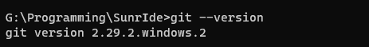

In order to access the command line in these examples I am using 
[Windows Terminal](https://www.microsoft.com/en-gb/p/windows-terminal/9n0dx20hk701#activetab=pivot:overviewtab)

In order to edit the files, I will be using [Visual Studio Code](https://code.visualstudio.com/)

## 2. Fork the repository

A fork is a copy of a repository on GitHub owned by a different user. Since you don't have edit 
access to this repository, you need to create your own copy in order to edit it. Then, once you have
 made your changes, you can submit them for review via a "pull request"

Click the button highlighted in red to fork this repository.

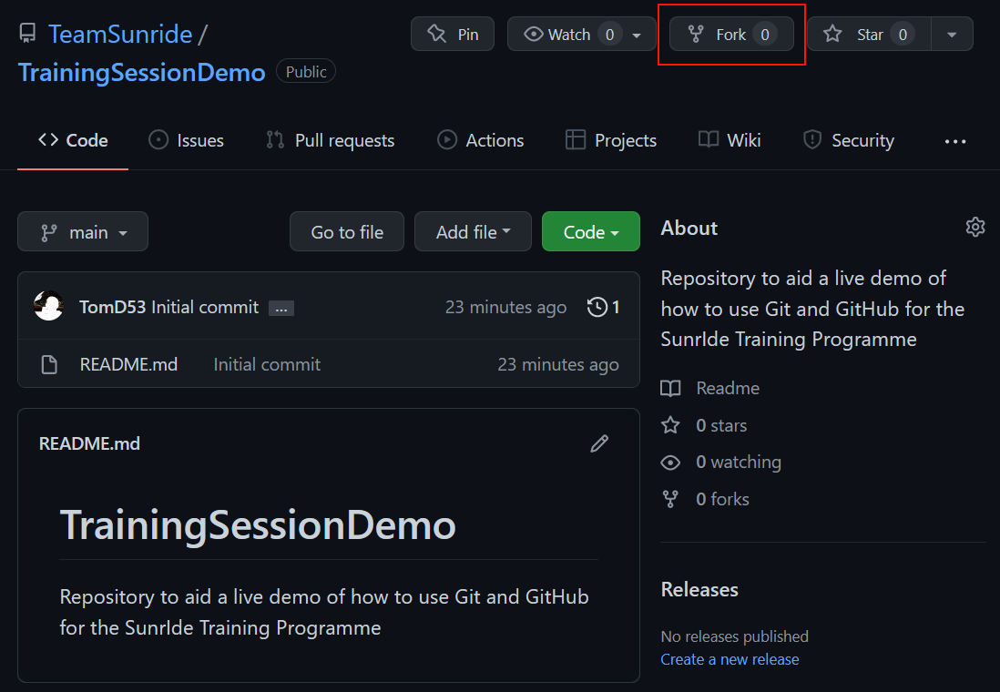

You should now see a copy of the repository associated with your own account.

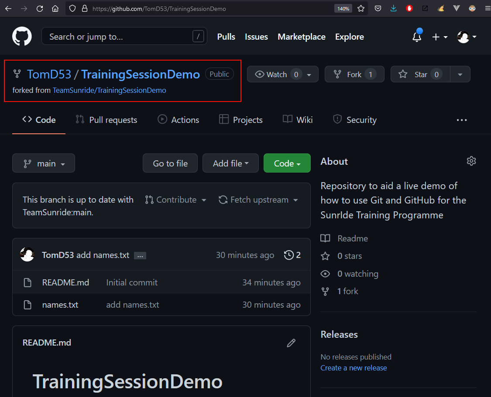

## 2. Clone your forked repository

Now that you've forked the repository, you need to download a copy of it to your own device / computer.

Copy the link to the repository from here. The link will be something like

`https://github.com/<your-username>/TrainingSessionDemo.git`

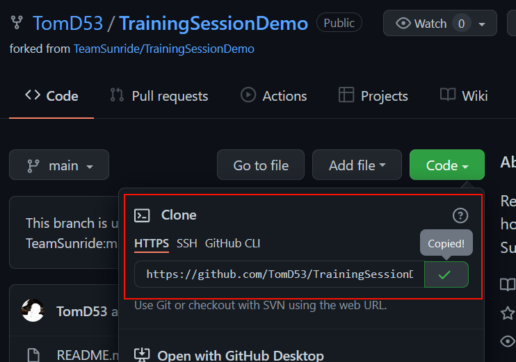

Now use the command `git clone https://github.com/<your-username>/TrainingSessionDemo.git` to create your local copy.

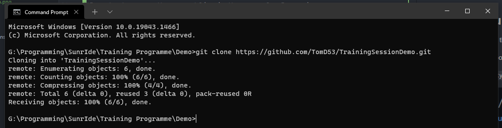

This will have created a folder which you can enter by using the `cd <folder>` command

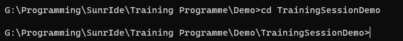

Now open the project using [Visual Studio Code](https://code.visualstudio.com/):

    code .

The `"."` refers to the current folder, so we are asking VS Code to launch in the current folder. You can also launch 
VS code normally in the desired folder, but this is faster.

## 3. Make your changes

The next step is to use VS Code to edit `names.txt` and add your name

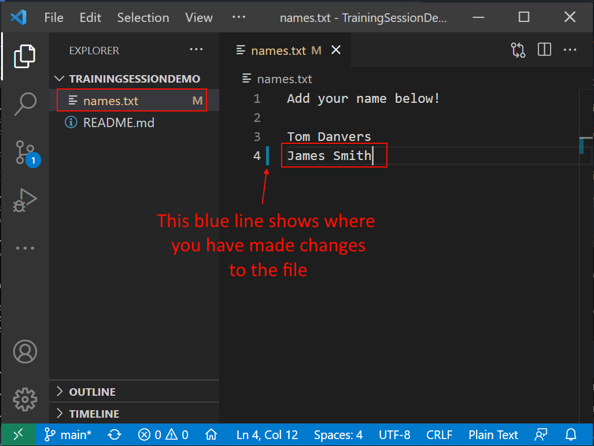

If we now go back to our terminal, and use the command `git status`, we can see the changed files:

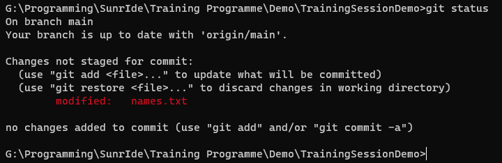

We can also view the difference between the old and new files by using the command `git diff`

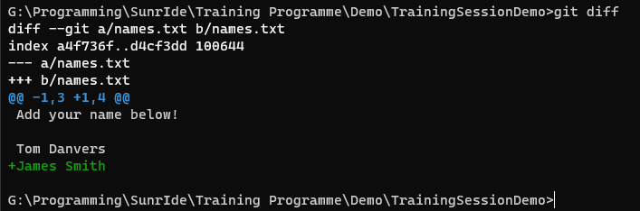

Before committing our changes, they need to be "staged". This allows you to control which files to add to each commit! 
To do this, use the command `git add`

    git add names.txt

If we run `git status` again, we can see that our changes are now staged for commit, highlighted in green.

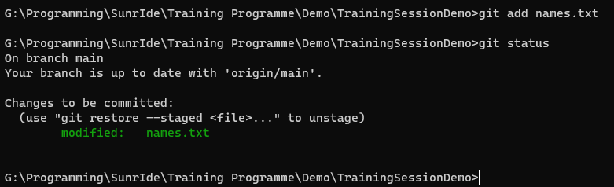

Now it is time to commit our changes. This records a snapshot of the project permanently in version history.

Each commit should be accompanied by a useful message that tells others what changed in that commit. In our case, 
a good commit message would be something like _"update names.txt"_

We use the `-m` flag to specify the commit message.

    git commit -m "update names.txt"

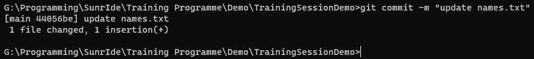

The changes are now made locally, but the remote repository (hosted on GitHub) needs updating. 
This is done with the `git push` command

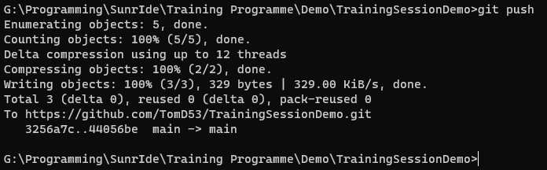

Now that we have pushed the changes to GitHub, we can view the changed `names.txt` file

## 4. Create a pull request

The next step is to create a pull request.

A pull request is _"a place to compare and discuss the differences introduced on a branch with reviews, comments, integrated
tests, and more"_

We do this through the GitHub website

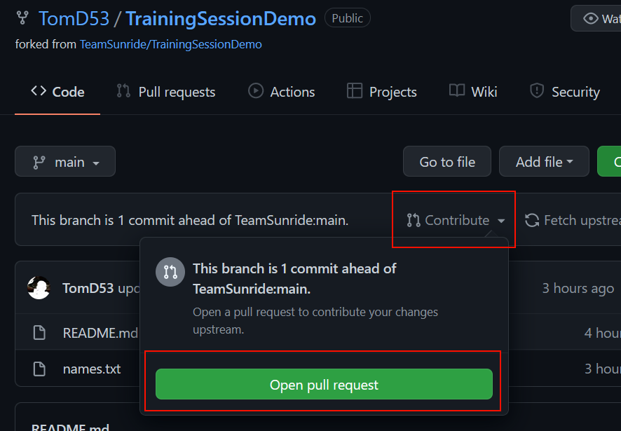
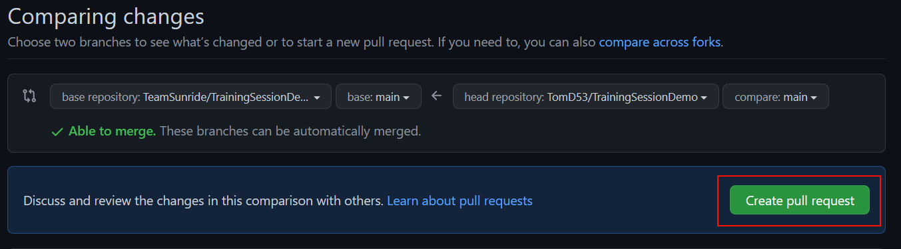

You can then give a description about the changes you have made, to help others understand 

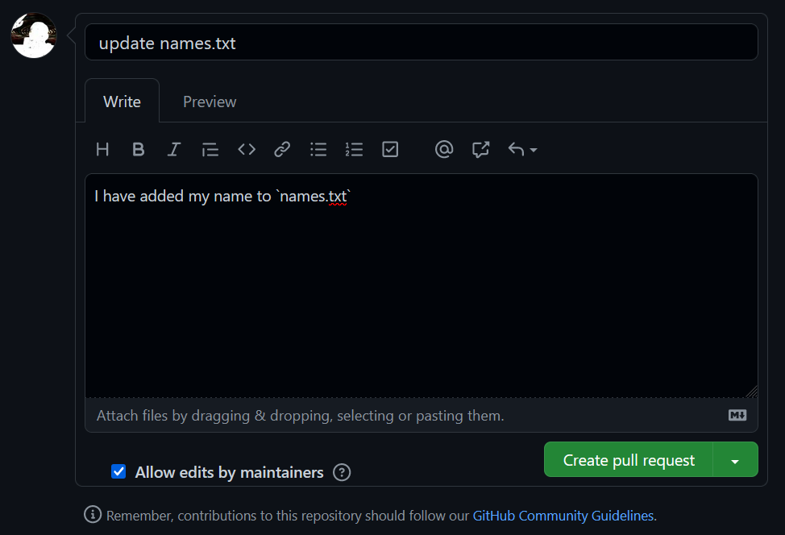

Others can comment on your changes and a discussion can be had

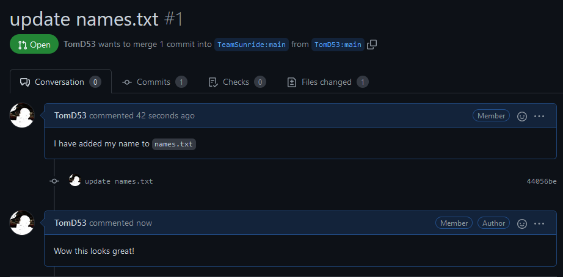

Maintainers of the project can then merge your changes when everyone is happy with them!

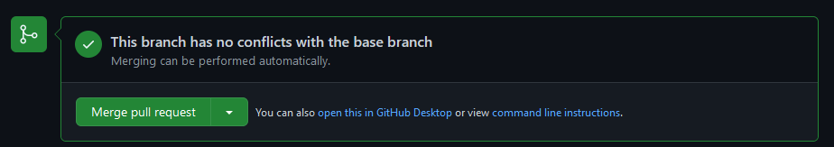

The pull request is then closed, and your code has been added to the project! Congratulations! 

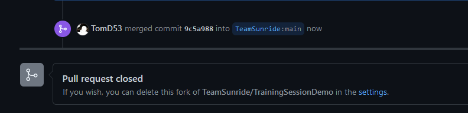

## What now?

Refer to [these docs about GitHub Flow](https://docs.github.com/en/get-started/quickstart/github-flow), which is very 
similar to what we just did, but with branches within a single repository

Try uploading one of your projects to GitHub using the things you learnt today.

Ask questions! Tag me (Tom#4831) or Yomi (Yomi#2706) on Discord and we'll gladly answer